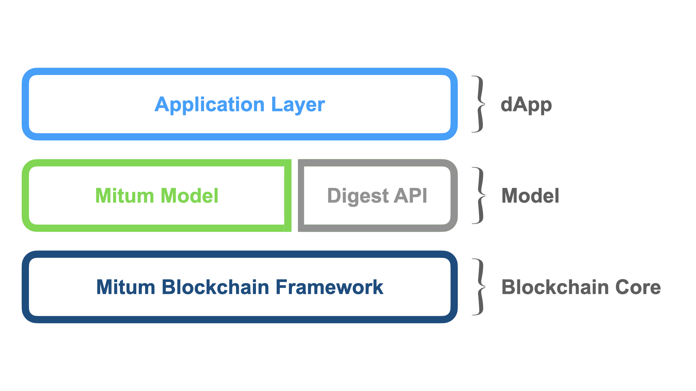

===================================================
Blockchain Application Model
===================================================

| *Mitum* is designed to be used as a general purpose blockchain. To meet this requirement, the **policy** and **data** of Mitum can be configured and managed in a practical way.

| In simpler terms, network designers will design their network in two parts:

* Data
* Policy

| By configuring the *data* and *policy*, designers can build and launch their own model of network.

| For example, suppose that a designer wants to build a currency model in Mitum. The designer can define several currencies and relative data and add additional policy.

| Data types:

* account
* balance

| Policy:

* total amount
* minimum amount of new balance
* multisig
* inflation
* etc...

| The following figure shows the relationship between the Mitum blockchain core and the Mitum model.

---------------------------------------------------
Digest Service
---------------------------------------------------

* **Digest Service** is an internal service that stores block data stored by Mitum separately to serve as *HTTP-based API*.
* The mitum-based model provides an API to query **state**.
* For more information on Digest Service, please refer to :ref:`rest api`.

---------------------------------------------------
Mitum-based models
---------------------------------------------------

* The Mitum model is a solution that can provide various services as an extension layer that extends the Mitum main chain.

* :ref:`currency`
* :ref:`currency extension`
* :ref:`document`
* :ref:`feefi`
* :ref:`nft`